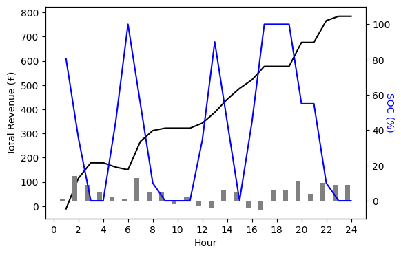

## Battery Revenue Optimizer

A Python package [batteryopt](https://github.com/SwatiInd/Battery-Revenue-Optimizer/tree/main/batteryopt) that maximises a battery’s day-ahead revenue by optimising charge, discharge, and idle decisions against an hourly price curve.
It combines a Pyomo model (batteryopt package) with tidy CSV templates for inputs and notebook-quality visualisations.

### Key features
- **Parametric battery model** – capacity, power rating, round-trip efficiencies, and initial state of charge are read from a simple table [battery parameters](https://github.com/SwatiInd/Battery-Revenue-Optimizer/blob/main/data/battery_parameters.csv). 
- **Price-trigger logic** – user-defined upper/lower price thresholds decide when energy can be bought or sold [price thresholds](https://github.com/SwatiInd/Battery-Revenue-Optimizer/blob/main/data/price_thresholds.csv).
- **Market Price**: forecasted/simulated hourly market prices [market price](https://github.com/SwatiInd/Battery-Revenue-Optimizer/blob/main/data/market_prices.csv)
- **MILP optimisation with Pyomo** – runs out-of-the-box with open-source GLPK, or switch to commercial solvers (Gurobi, CBC) for faster turnaround.
- **Jupyter demo** – [the notebook](https://github.com/SwatiInd/Battery-Revenue-Optimizer/blob/main/Price%20Strategy%20-%20Revenue%20and%20SOC.ipynb) walks through the entire flow with rich charts.
- **Clean outputs** – results land in a single DataFrame (opt_solved) plus high-resolution plots of battery state, SOC, and cumulative revenue.

### Optimizer Output

  
  

