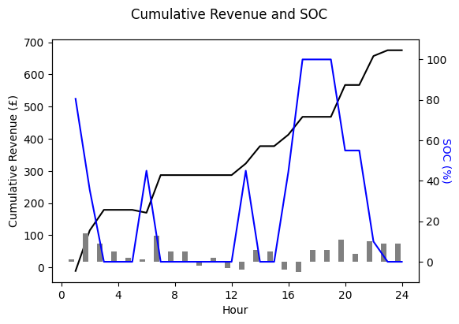

## Battery Revenue Optimizer

A Python workflow that maximises a battery’s day-ahead revenue by optimising charge, discharge, and idle decisions against an hourly price curve.
It combines a Pyomo model (batteryopt package) with tidy CSV templates for inputs and notebook-quality visualisations.

### Key features
- Parametric battery model – capacity, power rating, round-trip efficiencies, and initial state of charge are read from a simple table. 
- Price-trigger logic – user-defined upper/lower price thresholds decide when energy can be bought or sold. - 
- MILP optimisation with Pyomo – runs out-of-the-box with open-source GLPK, or switch to commercial solvers (Gurobi, CBC) for faster turnaround.
- Clean outputs – results land in a single DataFrame (opt_solved) plus high-resolution plots of battery state, SOC, and cumulative revenue.
- Jupyter demo – the notebook “Price Strategy – Revenue and SOC.ipynb” walks through the entire flow with rich charts. 

### Optimizer Output

  
  

